# CCBJI Data Platform – Data Model Reference

## Architecture Overview

```
External Sources                    Databricks Medallion
─────────────────    ADF Trigger    ─────────────────────────────────────────────
SAP (CSV)         ─── BlobCreated ──▶  Bronze  ──▶  Silver  ──▶  Gold (Star Schema)
Azure SQL (SQL)   ─── Schedule    ──▶  Bronze  ──▶  Silver  ──▶  Gold
REST API (JSON)   ─── Schedule    ──▶  Bronze  ──▶  Silver  ──▶  Gold
                                                               │
                                                               ▼
                                                    Audit / Observability Schema
```

| Layer  | Write Mode | Schema Enforcement | Notebook |
|--------|-----------|-------------------|----------|
| Bronze | Overwrite per batch | Enforced at read via SD YAML dtype | `SD_Standardization_Engine` |
| Silver | Append (all batches) | `mergeSchema=true`, transforms applied | `SD_Standardization_Engine` |
| Gold   | Upsert (SCD2 / merge) | Delta merge on surrogate / transaction key | `TF_Gold_Load_Engine` |
| Audit  | Append-only | Fixed schema – never updated | All notebooks + Azure Function |

---

## Gold Star Schema

```mermaid
erDiagram
    DIM_DATE {
        INT     date_key          PK "yyyyMMdd format"
        DATE    calendar_date
        INT     year
        INT     quarter
        INT     month
        STRING  month_name
        INT     week_of_year
        INT     day_of_week
        STRING  day_name
        BOOLEAN is_weekend
    }

    DIM_CUSTOMER {
        BIGINT  customer_key      PK "-1 = UNKNOWN sentinel"
        STRING  customer_id          "Natural key"
        STRING  customer_name
        STRING  region
        STRING  channel
        STRING  attribute_hash       "SHA-256 of tracked cols"
        DATE    effective_from
        DATE    effective_to         "9999-12-31 = current"
        BOOLEAN is_current
        STRING  batch_id
    }

    DIM_PRODUCT {
        BIGINT  product_key       PK "-1 = UNKNOWN sentinel"
        STRING  product_id           "Natural key"
        STRING  product_name
        STRING  brand
        STRING  category
        STRING  status
        STRING  attribute_hash
        DATE    effective_from
        DATE    effective_to
        BOOLEAN is_current
        STRING  batch_id
    }

    FACT_SALES {
        STRING  transaction_hash  PK "SHA-256 idempotency key"
        STRING  sales_id             "Degenerate dimension"
        INT     date_key          FK
        BIGINT  customer_key      FK "-1 if late-arriving"
        BIGINT  product_key       FK "-1 if late-arriving"
        INT     quantity
        DECIMAL net_amount
        STRING  currency
        STRING  source_system
        STRING  batch_id
        BOOLEAN needs_resolution     "True when any SK = -1"
        STRING  fact_batch_id
        TIMESTAMP fact_loaded_at
    }

    LATE_ARRIVING_BRIDGE {
        STRING    resolution_hash    PK "SHA-256 idempotency key"
        STRING    transaction_hash   FK
        STRING    dimension_name
        STRING    natural_key
        DATE      transaction_date
        STRING    resolution_status     "PENDING | RESOLVED"
        BIGINT    resolved_surrogate_key
        TIMESTAMP first_seen_timestamp
        TIMESTAMP resolved_timestamp
    }

    DIM_DATE        ||--o{ FACT_SALES              : date_key
    DIM_CUSTOMER    ||--o{ FACT_SALES              : customer_key
    DIM_PRODUCT     ||--o{ FACT_SALES              : product_key
    FACT_SALES      ||--o{ LATE_ARRIVING_BRIDGE    : transaction_hash
```



---

## Bronze Layer

All Bronze tables share the same pattern:

| Column | Type | Purpose |
|---|---|---|
| *(source columns)* | Per SD YAML dtype | Raw values, schema enforced at read |
| `batch_id` | STRING | ADF pipeline run ID or auto-generated timestamp |
| `processed_date` | TIMESTAMP | UTC write time |

Write mode: **overwrite** – each SD run replaces the Bronze partition with the latest batch.

### Tables

| Table | Source | Format | Key Column(s) |
|---|---|---|---|
| `bronze.sales_transactions` | SAP (ADLS landing) | CSV | `sales_id` |
| `bronze.customer_master` | Azure SQL (Parquet export) | Parquet | `customer_id` |
| `bronze.product_master` | Product REST API | JSON | `product_id` |

---

## Silver Layer

| Column | Type | Purpose |
|---|---|---|
| *(standardised source columns)* | Per SD YAML, with transforms | Trimmed / cased values |
| `batch_id` | STRING | Links row back to the Bronze partition |
| `processed_date` | TIMESTAMP | Inherited from Bronze |

Write mode: **append** – all batches accumulate. Query by `batch_id` to read a specific batch.

### Main Tables

| Table | Transforms | Error Table |
|---|---|---|
| `silver.sales_transactions` | trim on IDs; trim+upper on currency, source_system | `silver.sales_transactions_error` |
| `silver.customer_master` | trim on all string columns | `silver.customer_master_error` |
| `silver.product_master` | trim on IDs/names; trim+upper on status | `silver.product_master_error` |

### Error Tables (`*_error`)

Each error table mirrors the Silver table schema and adds:

| Column | Type | Purpose |
|---|---|---|
| `error_reason` | STRING | Human-readable description of the DQ failure |
| `error_timestamp` | TIMESTAMP | UTC time the error was captured |

Rows land here when DQ checks fail (null primary key, etc.). Never deleted – permanent audit trail.

---

## Gold Layer

### DimDate

Generated by `TF_Gold_Load_Engine` (object_type=`dimension`, no `scd_type`).
Full overwrite on each run. Range: 2024-01-01 → 2030-12-31.

Surrogate key: `date_key` (INT in `yyyyMMdd` format, e.g. `20260316`).
No UNKNOWN member – date dimension is complete and static.

---

### DimCustomer / DimProduct (SCD Type 2)

**Change detection:** SHA-256 hash over tracked columns (`attribute_hash`).  
A new row is inserted only when the hash changes; the previous row's `effective_to` is set to `effective_from - 1 day`.

**Surrogate key assignment:** `row_number() over (ORDER BY natural_key) + max_existing_key`.  
Guarantees continuity across incremental loads.

**UNKNOWN sentinel row:**

| Column | Value |
|---|---|
| `*_key` | `-1` |
| `*_id` | `UNKNOWN` |
| `effective_from` | `1900-01-01` |
| `effective_to` | `9999-12-31` |
| `is_current` | `true` |
| `batch_id` | `SYSTEM` |

Facts that cannot be matched to a dimension at load time receive `customer_key = -1` or `product_key = -1`.

---

### FactSales

**Idempotency:** `transaction_hash = SHA-256(source_system || sales_id || order_date)`.  
Delta merge on `transaction_hash` → duplicate source rows are suppressed.

**Temporal FK join:** at load time, each fact row is joined to the dimension version active on `order_date`:
```sql
ON fact.customer_id = dim.customer_id
   AND fact.order_date BETWEEN dim.effective_from AND dim.effective_to
```
The resolved `customer_key` / `product_key` is stored in the fact row. **No re-join at query time.**

**Late-arriving dimensions:** if no dimension row exists for a natural key on the transaction date, the fact receives `*_key = -1` and `needs_resolution = true`. A `PENDING` entry is written to `late_arriving_dimension_bridge`.

---

### Late-Arriving Dimension Bridge

Populated by `TF_Gold_Load_Engine`. Resolved by `TF_Resolve_Late_Dimensions`.

**Resolution flow:**
1. `TF_Gold_Load_Engine` writes `PENDING` rows for every unresolved FK.
2. `TF_Resolve_Late_Dimensions` (scheduled after all dims and facts load) does a temporal join from the bridge to the dimension.
3. On success: fact FK is backfilled, bridge entry marked `RESOLVED`, `needs_resolution` cleared where all FKs are filled.

---

## Audit Schema

### `audit.pipeline_run_log`

One row per notebook invocation. Written by all three engine notebooks.

| Key Column | Purpose |
|---|---|
| `run_id` | UUID per invocation – join to `dq_check_log` |
| `status` | `SUCCESS` / `FAILED` / `SKIPPED` / `ROW_COUNT_MISMATCH` / `PARTIAL_RESOLUTION` |
| `rows_read` / `rows_written` / `rows_rejected` | Row flow accounting |
| `duration_seconds` | Wall-clock execution time |
| `error_message` | Exception text if status = `FAILED` |

**Example query – today's runs:**
```sql
SELECT pipeline_name, batch_id, status, rows_read, rows_written, duration_seconds
FROM   audit.pipeline_run_log
WHERE  DATE(started_at) = current_date()
ORDER  BY started_at;
```

---

### `audit.dq_check_log`

One row per DQ rule per batch. Written by `SD_Standardization_Engine`.

| `check_name` | Evaluates |
|---|---|
| `row_count_bronze_vs_source` | Bronze row count = landing row count |
| `row_count_silver_vs_source` | Silver batch row count = landing row count |
| `null_primary_key` | No null values in the primary key column |

**Example query – failed checks last 7 days:**
```sql
SELECT check_name, target_table, expected_value, actual_value, row_count, checked_at
FROM   audit.dq_check_log
WHERE  check_status = 'FAILED'
  AND  checked_at  >= current_date() - INTERVAL 7 DAYS
ORDER  BY checked_at DESC;
```

---

### `audit.alert_log`

One row per alert notification. Written by the Azure Function and ADF failure pipelines (not by notebooks).

| `alert_type` | Trigger |
|---|---|
| `PIPELINE_FAILURE` | ADF notebook activity returned non-zero exit |
| `SLA_BREACH` | Gold pipeline completed after `sla_time` (06:00 JST) |
| `DQ_FAILURE` | SD notebook exited with `status = ROW_COUNT_MISMATCH` |
| `ROW_COUNT_ANOMALY` | Rows loaded deviate > threshold from rolling average |

---

## Key Design Decisions

| Decision | Rationale |
|---|---|
| SCD Type 2 for dimensions | Enables point-in-time fact analysis without re-processing history |
| SHA-256 attribute hash | Single-column change detection; avoids multi-column comparison bugs |
| Transaction hash on fact | Idempotent upserts tolerate ADF retry and re-trigger without duplicates |
| Temporal FK at load time | Query performance – no runtime dimension join in analytical queries |
| UNKNOWN member (-1) | Referential integrity in BI tools; bridge handles backfill asynchronously |
| Bridge + resolution pass | Decouples late dimension arrival from fact load; no blocking dependency |
| `batch_id` as partition key | Efficient incremental reads; supports rollback by dropping a partition |
| `mergeSchema=true` on Silver | Safe schema evolution – new source columns auto-propagate to Silver |
